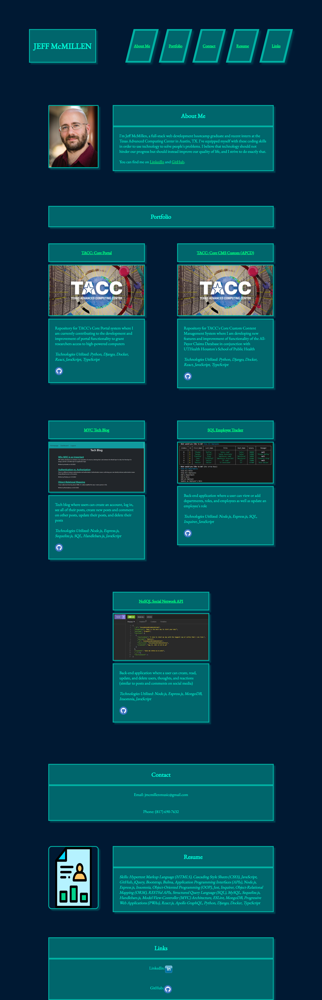

# Jeff-McMillen-React-Portfolio

## Description

As a full-stack web developer (MERN Stack), I must put my best foot forward for potential employers by creating a new portfolio using React and showcasing my best full-stack work. This portfolio is the culmination of my work so far.

## Installation

You can access this page with the following URL:
https://jmcmillenmusic.github.io/jeff-mcmillen-react-portfolio/

## Usage

Click on any of the links at the top to access each of the sections. In the Portfolio section, click on any of the pictures to see that project in a new tab. Click on the Resume Icon in the Resume section to download a copy of my resume. 

## Credits

N/A

## License

This project uses the MIT License.
